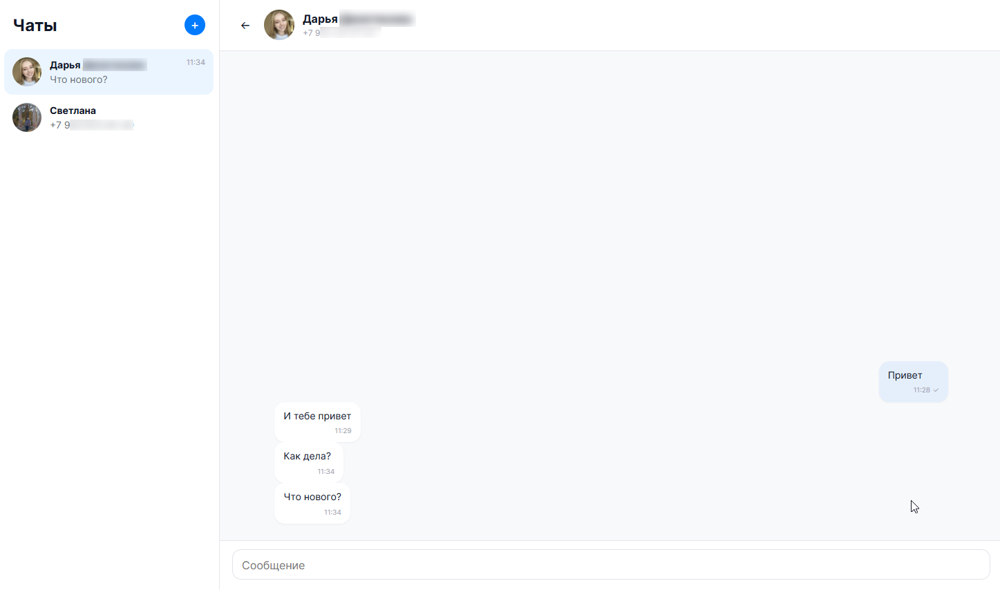
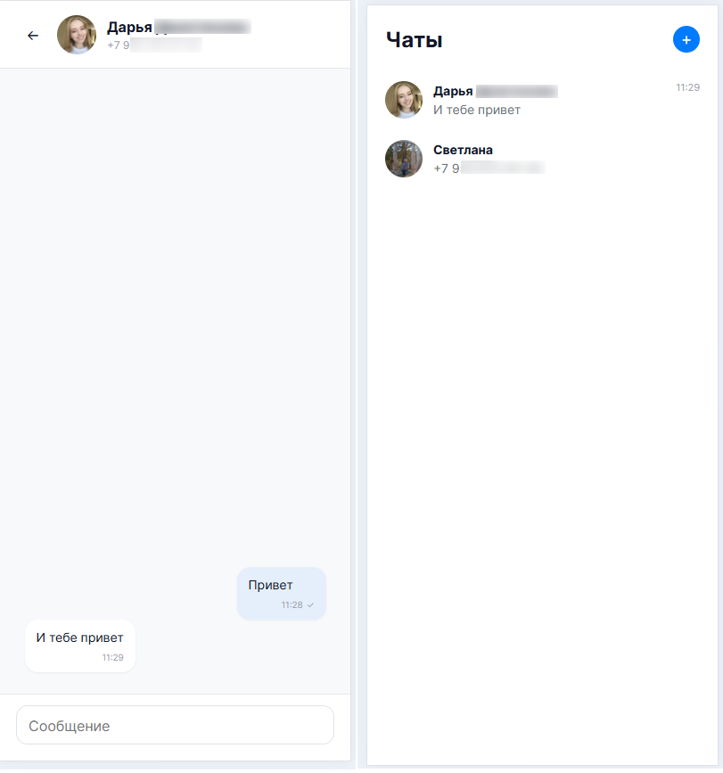

# M Chat

Веб-клиент для обмена текстовыми сообщениями в MAX через [GREEN-API](https://green-api.com/max).

**Демо:** [max-chat-react-ts-xi.vercel.app](https://max-chat-react-ts-xi.vercel.app)

## Стек

- React + TypeScript
- Vite
- Eslint
- GREEN-API (методы `sendMessage`, `receiveNotification`, `deleteNotification`, `getStateInstance`, `getContactInfo`, `checkAccount`)

## Возможности

- Авторизация по `idInstance` и `apiTokenInstance`
- Создание чата по номеру телефона
- Отправка текстовых сообщений с оптимистичным UI
- Получение сообщений через long polling
- Аватары, имена и счётчик непрочитанных
- Адаптивная вёрстка (десктоп и мобильный)

## Скриншоты

### Авторизация


### Чат


### Мобильный вид


## Запуск

```bash
npm install
npm run dev
